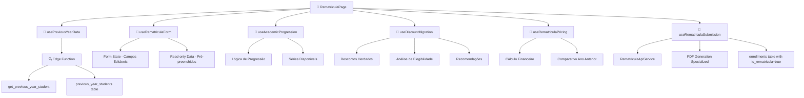

# 🎓 Plano de Implementação - Fluxo de Rematrícula Independente

## 🎯 Visão Estratégica

### Princípio Fundamental: **Arquitectura Independente**
- **Zero dependência** do `useEnrollmentForm` existente
- **Hooks especializados** criados especificamente para rematrícula
- **Manutenção** do fluxo de nova matrícula intacto
- **Reutilização seletiva** apenas de utilitários e validações
- **Sistema completo** e auto-suficiente

### Objetivos de Negócio
1. **Experiência UX Superior**: One-page form com dados pré-preenchidos
2. **Performance Otimizada**: Carregamento rápido via nova tabela dedicada
3. **Manutenibilidade**: Código isolado e testável
4. **Consistência**: Mesma lógica de descontos e aprovações
5. **Escalabilidade**: Preparado para múltiplos anos acadêmicos

---

## 📊 Mapeamento de Regras de Negócio Específicas

### 🔍 Validação de CPF (Portão de Entrada)
```
INPUT: CPF do usuário na página inicial

ALGORITMO DE CLASSIFICAÇÃO:
├── CPF existe em `enrollments` (2026)? 
│   └── YES → 🚫 "CPF já cadastrado para 2026"
├── CPF existe em `previous_year_students` (2025)?
│   └── YES → ✅ REDIRECIONAR para /rematricula
└── CPF não encontrado?
    └── ✅ REDIRECIONAR para /nova-matricula
```

### 📚 Regras de Progressão Acadêmica
```typescript
interface ProgressionRules {
  // Progressão Normal
  "ef1_1ano": ["ef1_2ano"],           // 1º → 2º ano
  "ef1_2ano": ["ef1_3ano"],           // 2º → 3º ano
  "ef1_3ano": ["ef1_4ano"],           // 3º → 4º ano
  "ef1_4ano": ["ef1_5ano"],           // 4º → 5º ano
  "ef1_5ano": ["ef2_6ano"],           // 5º → 6º ano
  
  // Progressão EF2
  "ef2_6ano": ["ef2_7ano"],           // 6º → 7º ano
  "ef2_7ano": ["ef2_8ano"],           // 7º → 8º ano
  "ef2_8ano": ["ef2_9ano"],           // 8º → 9º ano
  "ef2_9ano": ["em_1ano"],            // 9º → 1º EM
  
  // Progressão Ensino Médio
  "em_1ano": ["em_2ano"],             // 1º → 2º EM
  "em_2ano": ["em_3ano"],             // 2º → 3º EM
  "em_3ano": ["graduacao"],           // 3º EM → Formatura
  
  // Casos Especiais
  repetencia: "mesma_serie",          // Repetir série atual
  transferencia: "qualquer_serie",    // Admin define
}
```

### 💰 Regras de Migração de Descontos
```typescript
interface DiscountMigrationLogic {
  // 1. HERANÇA AUTOMÁTICA (Padrão)
  inheritPreviousDiscounts: {
    condition: "manter_mesmos_descontos = true",
    process: [
      "carregar descontos do ano anterior",
      "validar elegibilidade atual (CEP, situação familiar)",
      "aplicar automaticamente se ainda elegíveis",
      "alertar sobre descontos perdidos"
    ]
  }
  
  // 2. SELEÇÃO MANUAL (Alternativa)
  manualDiscountSelection: {
    condition: "manter_mesmos_descontos = false",
    process: [
      "mostrar descontos anteriores como referência",
      "abrir sistema completo de seleção",
      "aplicar mesma lógica de trilhos e caps",
      "gerar comparativo (antes vs depois)"
    ]
  }
  
  // 3. VALIDAÇÕES ESPECIAIS
  validationRules: {
    "CEP_CHANGED": "recalcular elegibilidade geográfica",
    "SIBLINGS_CHANGED": "revalidar desconto IIR",
    "PROFESSIONAL_STATUS_CHANGED": "revalidar PASS/PBS/COL/SAE",
    "INCOME_CHANGED": "revalidar bolsas ABI/ABP"
  }
}
```

### 🏢 Regras de Escola e Trilhos
```typescript
interface SchoolTransferRules {
  // Transferência entre escolas permitida
  "pelicano_to_sete_setembro": {
    allowed: true,
    process: "revalidar série disponível na escola destino"
  },
  
  "sete_setembro_to_pelicano": {
    allowed: true,
    process: "revalidar série disponível na escola destino"
  },
  
  // Trilhos mantidos por padrão, mas podem ser alterados
  trackMaintenance: "preservar trilho anterior se disponível na nova série"
}
```

---

## 🏗️ Arquitetura de Hooks Independentes

### Princípio de Design: **Single Responsibility + Composição**

```typescript
// =====================================
// CAMADA 1: DATA FETCHING ESPECIALIZADO
// =====================================

/**
 * Hook especializado para buscar dados do ano anterior
 * Substitui completamente useEnrollmentForm para rematrícula
 */
interface usePreviousYearDataResult {
  student: PreviousYearStudent | null
  discounts: PreviousYearDiscount[]
  isLoading: boolean
  error: string | null
  refetch: () => void
}

export function usePreviousYearData(cpf: string, birthHint: string): usePreviousYearDataResult

/**
 * Hook para validação de progressão acadêmica
 * Lógica específica para rematrícula (sem dependências externas)
 */
interface useAcademicProgressionResult {
  availableSeries: Series[]
  recommendedSeries: Series | null
  isValidProgression: (currentSeries: string, targetSeries: string) => boolean
  progressionWarnings: string[]
}

export function useAcademicProgression(
  currentSeries: string, 
  escola: EscolaType
): useAcademicProgressionResult

// =====================================
// CAMADA 2: BUSINESS LOGIC ESPECIALIZADA
// =====================================

/**
 * Hook de cálculo financeiro específico para rematrícula
 * Não depende de useEnrollmentForm
 */
interface useRematriculaPricingResult {
  baseValue: number
  appliedDiscounts: DiscountCalculation[]
  totalDiscountPercentage: number
  finalValue: number
  approvalLevel: 'automatic' | 'coordinator' | 'director'
  needsApproval: boolean
  pricingComparison: {
    previousYear: FinancialSummary
    currentYear: FinancialSummary
    difference: number
  }
}

export function useRematriculaPricing(
  selectedSeries: Series,
  selectedDiscounts: DiscountSelection[],
  previousYearFinance: PreviousYearFinance
): useRematriculaPricingResult

/**
 * Hook para migração inteligente de descontos
 * Lógica específica para determinar quais descontos manter/alterar
 */
interface useDiscountMigrationResult {
  inheritedDiscounts: InheritedDiscount[]
  eligibilityChanges: EligibilityChange[]
  recommendedActions: DiscountAction[]
  migrationStrategy: 'keep_all' | 'keep_eligible' | 'manual_selection'
  applyInheritedDiscounts: () => void
  openManualSelection: () => void
}

export function useDiscountMigration(
  previousDiscounts: PreviousYearDiscount[],
  currentAddress: AddressData,
  eligibilityContext: EligibilityContext
): useDiscountMigrationResult

// =====================================
// CAMADA 3: FORM STATE ESPECIALIZADO
// =====================================

/**
 * Hook de formulário específico para rematrícula
 * Gerencia apenas os campos editáveis, não todos os campos como useEnrollmentForm
 */
interface useRematriculaFormResult {
  // Form state (apenas campos editáveis)
  form: UseFormReturn<RematriculaFormData>
  
  // Dados read-only pré-preenchidos
  readOnlyData: PreviousYearStudent
  
  // Estados específicos da rematrícula
  isSubmitting: boolean
  migrationMode: 'inherit' | 'manual'
  selectedSeries: Series | null
  
  // Ações
  setMigrationMode: (mode: 'inherit' | 'manual') => void
  selectSeries: (series: Series) => void
  submitRematricula: () => Promise<void>
  
  // Validações
  canSubmit: boolean
  validationErrors: ValidationError[]
}

export function useRematriculaForm(previousData: PreviousYearStudent): useRematriculaFormResult

// =====================================
// CAMADA 4: SUBMISSION ESPECIALIZADA
// =====================================

/**
 * Hook para submissão específica de rematrícula
 * Usa API própria, não depende do EnrollmentApiService
 */
interface useRematriculaSubmissionResult {
  submitRematricula: (data: RematriculaSubmissionData) => Promise<string>
  generatePDF: (enrollmentId: string) => Promise<string>
  isSubmitting: boolean
  submitError: string | null
}

export function useRematriculaSubmission(): useRematriculaSubmissionResult
```

### 🔄 Fluxo de Dados - Arquitetura Independente



### 📁 Estrutura de Arquivos Independente

```
src/features/rematricula-v2/                    # Nova implementação
├── pages/
│   └── RematriculaPage.tsx                    # Página principal (substituirá OnePageRematricula)
├── hooks/
│   ├── data/
│   │   ├── usePreviousYearData.ts             # Busca dados ano anterior
│   │   └── useAcademicProgression.ts          # Progressão acadêmica
│   ├── business/
│   │   ├── useRematriculaPricing.ts           # Cálculos financeiros
│   │   └── useDiscountMigration.ts            # Migração de descontos
│   ├── form/
│   │   └── useRematriculaForm.ts              # Estado do formulário
│   └── submission/
│       └── useRematriculaSubmission.ts        # Submissão
├── components/
│   ├── sections/
│   │   ├── StudentReadOnlySection.tsx         # Dados read-only do aluno
│   │   ├── EditableDataSection.tsx            # Responsáveis/Endereço editáveis
│   │   ├── AcademicProgressionSection.tsx     # Seleção de série
│   │   ├── DiscountMigrationSection.tsx       # Migração de descontos
│   │   └── FinancialComparisonSection.tsx     # Comparativo financeiro
│   └── ui/
│       ├── ProgressionSelector.tsx            # Seletor de série
│       ├── DiscountInheritanceCard.tsx        # Card de herança de descontos
│       └── PricingComparison.tsx              # Comparação antes/depois
├── services/
│   ├── RematriculaApiService.ts               # API especializada
│   ├── progressionRules.ts                    # Regras de progressão
│   └── discountMigrationRules.ts              # Regras de migração
├── types/
│   ├── rematricula.ts                         # Tipos específicos
│   ├── progression.ts                         # Tipos de progressão
│   └── migration.ts                           # Tipos de migração
└── utils/
    ├── progressionValidator.ts                # Validador de progressão
    ├── discountEligibilityAnalyzer.ts         # Análise de elegibilidade
    └── financialComparator.ts                 # Comparador financeiro
```

---

## 🧹 FASE ZERO: Limpeza e Preparação

### 🎯 Objetivo
Limpar a implementação atual parcial e preparar terreno limpo para nova arquitetura independente.

### 📋 Inventário do Estado Atual (Para Limpeza)

```typescript
// ❌ ARQUIVOS A SEREM REMOVIDOS/MOVIDOS
src/features/rematricula/                      # Implementação atual parcial
├── hooks/useRematriculaForm.ts               # ❌ Remove (depende de useEnrollmentForm)
├── hooks/useRematriculaDiscounts.ts          # ❌ Remove (acoplado)
├── hooks/useAcademicProgression.ts           # ❌ Remove (incompleto)
├── pages/OnePageRematricula.tsx              # ❌ Remove (implementação parcial)
├── services/previousYear.ts                  # ✅ Avaliar reutilização
├── utils/mapping.ts                          # ✅ Avaliar reutilização  
├── utils/progression.ts                      # ✅ Avaliar reutilização
└── types/index.ts                            # ✅ Avaliar reutilização

src/pages/Rematricula.tsx                     # ❌ Remove (wrapper simples)

// ✅ MANTER/REUTILIZAR (Se úteis)
supabase/functions/get_previous_year_student/  # ✅ Manter (já implementado)
supabase/functions/validate_cpf/               # ✅ Manter (já implementado)
supabase/migrations/020_create_previous_year_students.sql # ✅ Manter
```

### 🛠️ Plano de Limpeza Detalhado

#### Etapa 1: Backup e Documentação
```bash
# 1. Criar backup da implementação atual
mkdir -p backups/rematricula-old/$(date +%Y%m%d_%H%M%S)
cp -r src/features/rematricula backups/rematricula-old/$(date +%Y%m%d_%H%M%S)/
cp src/pages/Rematricula.tsx backups/rematricula-old/$(date +%Y%m%d_%H%M%S)/

# 2. Documentar dependências atuais
echo "# Dependências removidas em $(date)" > REMOVED_DEPENDENCIES.md
grep -r "useEnrollmentForm" src/features/rematricula/ >> REMOVED_DEPENDENCIES.md
grep -r "EnrollmentFormData" src/features/rematricula/ >> REMOVED_DEPENDENCIES.md
```

#### Etapa 2: Remoção Seletiva
```typescript
// 1. Remover arquivos com dependências de useEnrollmentForm
REMOVE: src/features/rematricula/hooks/useRematriculaForm.ts
REMOVE: src/features/rematricula/hooks/useRematriculaDiscounts.ts  
REMOVE: src/features/rematricula/pages/OnePageRematricula.tsx
REMOVE: src/pages/Rematricula.tsx

// 2. Mover utilitários úteis para pasta temporária
MOVE: src/features/rematricula/services/previousYear.ts 
      → src/features/rematricula-v2/legacy/previousYear.ts
MOVE: src/features/rematricula/utils/mapping.ts
      → src/features/rematricula-v2/legacy/mapping.ts
MOVE: src/features/rematricula/types/index.ts
      → src/features/rematricula-v2/legacy/types.ts
```

#### Etapa 3: Limpeza de Rotas
```typescript
// src/App.tsx - Remover rotas antigas
REMOVE:
- <Route path="/rematricula" element={<Rematricula />} />
- <Route path="/rematricula/:cpf" element={<Rematricula />} />

// src/pages/Index.tsx - Limpeza (se necessário)
REVIEW: Lógica de redirecionamento para rematrícula
```

#### Etapa 4: Auditoria de Dependências
```bash
# Buscar referências remanescentes
grep -r "useEnrollmentForm" src/ --exclude-dir=node_modules
grep -r "OnePageRematricula" src/ --exclude-dir=node_modules  
grep -r "useRematriculaForm" src/ --exclude-dir=node_modules

# Verificar se quebrou algo na nova matrícula
npm run build
npm run type-check
```

---

## 🚀 FASES DE IMPLEMENTAÇÃO

### 🏗️ FASE 1: Fundação Independente (Semana 1-2)

#### Etapa 1.1: Estrutura Base
```bash
# Criar estrutura de pastas
mkdir -p src/features/rematricula-v2/{hooks/{data,business,form,submission},components/{sections,ui},services,types,utils}

# Arquivos base
touch src/features/rematricula-v2/types/{rematricula,progression,migration}.ts
touch src/features/rematricula-v2/services/{RematriculaApiService,progressionRules,discountMigrationRules}.ts
```

#### Etapa 1.2: Tipos e Contratos
```typescript
// src/features/rematricula-v2/types/rematricula.ts
interface RematriculaFormData {
  // Apenas campos editáveis (não tudo como useEnrollmentForm)
  guardians: GuardiansData        // Editável
  address: AddressData           // Editável  
  academic: {
    selectedSeriesId: string     // Nova série selecionada
    shift: ShiftType            // Pode ser alterado
  }
  discountMigration: {
    strategy: 'inherit' | 'manual'
    selectedDiscounts?: DiscountSelection[]
  }
}

interface RematriculaState {
  // Estado específico da rematrícula
  previousData: PreviousYearStudent
  currentFormData: RematriculaFormData
  pricing: RematriculaPricing
  migrationAnalysis: DiscountMigrationAnalysis
  validationStatus: RematriculaValidationStatus
}
```

#### Etapa 1.3: Hook Base de Dados
```typescript
// src/features/rematricula-v2/hooks/data/usePreviousYearData.ts
export function usePreviousYearData(cpf: string, birthHint: string) {
  return useQuery({
    queryKey: ['rematricula-previous-data', cpf, birthHint],
    queryFn: async () => {
      // Chamada direta ao Edge Function (sem dependências)
      const response = await supabase.functions.invoke('get_previous_year_student', {
        body: { cpf, birth_date_hint: birthHint }
      })
      
      if (response.error) throw new Error(response.error.message)
      return response.data
    },
    enabled: Boolean(cpf && birthHint),
    staleTime: 5 * 60 * 1000, // Cache 5 min
    retry: 1
  })
}
```

### 🧠 FASE 2: Lógica de Negócio Independente (Semana 3-4)

#### Etapa 2.1: Regras de Progressão
```typescript
// src/features/rematricula-v2/services/progressionRules.ts
export class ProgressionRulesEngine {
  static validateProgression(
    currentSeries: string, 
    targetSeries: string,
    escola: EscolaType
  ): ValidationResult {
    const rules = this.getProgressionMatrix()
    const allowedTransitions = rules[currentSeries] || []
    
    return {
      isValid: allowedTransitions.includes(targetSeries),
      warnings: this.generateWarnings(currentSeries, targetSeries),
      recommendations: this.getRecommendations(currentSeries, escola)
    }
  }
  
  static getProgressionMatrix(): ProgressionMatrix {
    return {
      "ef1_5ano": ["ef2_6ano"],           // Normal: 5º → 6º
      "ef2_7ano": ["ef2_8ano"],           // Normal: 7º → 8º  
      "em_2ano": ["em_3ano"],             // Normal: 2º EM → 3º EM
      // ... matriz completa
    }
  }
}
```

#### Etapa 2.2: Motor de Migração de Descontos
```typescript
// src/features/rematricula-v2/services/discountMigrationRules.ts
export class DiscountMigrationEngine {
  static analyzeMigration(
    previousDiscounts: PreviousYearDiscount[],
    currentContext: EligibilityContext
  ): MigrationAnalysis {
    const analysis: MigrationAnalysis = {
      eligibleToInherit: [],
      noLongerEligible: [],
      needsValidation: [],
      newlyAvailable: []
    }
    
    for (const discount of previousDiscounts) {
      const eligibilityCheck = this.checkCurrentEligibility(discount, currentContext)
      
      if (eligibilityCheck.status === 'eligible') {
        analysis.eligibleToInherit.push(discount)
      } else if (eligibilityCheck.status === 'ineligible') {
        analysis.noLongerEligible.push({
          discount,
          reason: eligibilityCheck.reason
        })
      } else {
        analysis.needsValidation.push({
          discount,
          validationRequired: eligibilityCheck.validationSteps
        })
      }
    }
    
    return analysis
  }
}
```

#### Etapa 2.3: Cálculo Financeiro Especializado
```typescript
// src/features/rematricula-v2/hooks/business/useRematriculaPricing.ts
export function useRematriculaPricing(
  selectedSeries: Series,
  selectedDiscounts: DiscountSelection[],
  previousYearFinance: PreviousYearFinance
) {
  return useMemo(() => {
    const baseValue = selectedSeries.valor_mensal_sem_material
    const materialCost = selectedSeries.valor_material
    
    // Lógica de cálculo INDEPENDENTE (não usa calculatePricing do useEnrollmentForm)
    const discountCalculations = selectedDiscounts.map(discount => ({
      id: discount.id,
      code: discount.code,
      percentage: discount.percentage,
      value: (baseValue * discount.percentage) / 100
    }))
    
    const totalDiscountValue = discountCalculations.reduce((sum, d) => sum + d.value, 0)
    const finalValue = baseValue - totalDiscountValue + materialCost
    
    // Comparativo com ano anterior
    const pricingComparison = {
      previousYear: previousYearFinance,
      currentYear: {
        baseValue,
        materialCost,
        totalDiscountValue,
        finalValue
      },
      difference: finalValue - previousYearFinance.final_monthly_value
    }
    
    return {
      baseValue,
      materialCost,
      appliedDiscounts: discountCalculations,
      totalDiscountValue,
      finalValue,
      approvalLevel: determineApprovalLevel(totalDiscountValue),
      pricingComparison
    }
  }, [selectedSeries, selectedDiscounts, previousYearFinance])
}
```

### 📝 FASE 3: Formulário e UX Especializados (Semana 5-6)

#### Etapa 3.1: Hook de Formulário Independente
```typescript
// src/features/rematricula-v2/hooks/form/useRematriculaForm.ts
export function useRematriculaForm(previousData: PreviousYearStudent) {
  // Form apenas para campos editáveis (não todos os campos como useEnrollmentForm)
  const form = useForm<RematriculaFormData>({
    resolver: zodResolver(rematriculaSchema), // Schema específico
    defaultValues: {
      guardians: previousData.guardians,    // Pré-preenchido, editável
      address: previousData.address,        // Pré-preenchido, editável
      academic: {
        selectedSeriesId: '',               // Novo campo
        shift: previousData.academic.shift  // Pode ser alterado
      },
      discountMigration: {
        strategy: 'inherit'                 // Default: herdar descontos
      }
    },
    mode: 'onChange'
  })
  
  // Estados específicos da rematrícula
  const [migrationMode, setMigrationMode] = useState<'inherit' | 'manual'>('inherit')
  const [selectedSeries, setSelectedSeries] = useState<Series | null>(null)
  const [isSubmitting, setIsSubmitting] = useState(false)
  
  // Lógica de validação específica
  const canSubmit = useMemo(() => {
    return selectedSeries !== null && 
           form.formState.isValid && 
           !isSubmitting
  }, [selectedSeries, form.formState.isValid, isSubmitting])
  
  return {
    form,
    readOnlyData: previousData,
    isSubmitting,
    migrationMode,
    selectedSeries,
    setMigrationMode,
    selectSeries: setSelectedSeries,
    canSubmit,
    validationErrors: Object.values(form.formState.errors)
  }
}
```

#### Etapa 3.2: Componentes Especializados
```typescript
// src/features/rematricula-v2/components/sections/DiscountMigrationSection.tsx
export function DiscountMigrationSection({ 
  previousDiscounts, 
  migrationAnalysis, 
  onStrategyChange 
}) {
  return (
    <Card>
      <CardHeader>
        <CardTitle className="flex items-center gap-2">
          💰 Descontos Aplicados
          <Badge variant="secondary">{previousDiscounts.length} no ano anterior</Badge>
        </CardTitle>
      </CardHeader>
      <CardContent className="space-y-4">
        
        {/* Estratégia de Migração */}
        <div className="grid gap-4">
          <Label>Como deseja proceder com os descontos?</Label>
          
          <RadioGroup 
            value={strategy} 
            onValueChange={onStrategyChange}
            className="grid grid-cols-1 gap-4"
          >
            <div className="flex items-center space-x-2 p-4 border rounded-lg">
              <RadioGroupItem value="inherit" id="inherit" />
              <div className="flex-1">
                <Label htmlFor="inherit" className="font-medium">
                  ✅ Manter os mesmos descontos
                </Label>
                <p className="text-sm text-muted-foreground">
                  Aplicar automaticamente os descontos que ainda são elegíveis
                </p>
              </div>
            </div>
            
            <div className="flex items-center space-x-2 p-4 border rounded-lg">
              <RadioGroupItem value="manual" id="manual" />
              <div className="flex-1">
                <Label htmlFor="manual" className="font-medium">
                  🔧 Escolher novamente
                </Label>
                <p className="text-sm text-muted-foreground">
                  Abrir sistema completo de seleção de descontos
                </p>
              </div>
            </div>
          </RadioGroup>
        </div>
        
        {/* Preview dos Descontos */}
        {strategy === 'inherit' && (
          <DiscountInheritancePreview 
            eligible={migrationAnalysis.eligibleToInherit}
            ineligible={migrationAnalysis.noLongerEligible}
          />
        )}
        
      </CardContent>
    </Card>
  )
}
```

### 🔗 FASE 4: API e Persistência Independentes (Semana 7)

#### Etapa 4.1: Service API Especializado
```typescript
// src/features/rematricula-v2/services/RematriculaApiService.ts
export class RematriculaApiService {
  /**
   * Submete rematrícula - API especializada
   * NÃO usa EnrollmentApiService.createEnrollment
   */
  static async submitRematricula(data: RematriculaSubmissionData): Promise<string> {
    try {
      // 1. Mapear dados específicos da rematrícula
      const enrollmentData = this.mapRematriculaToEnrollment(data)
      
      // 2. Inserir na tabela enrollments com campos específicos
      const { data: created, error } = await supabase
        .from('enrollments')
        .insert({
          ...enrollmentData,
          is_rematricula: true,                    // ✅ Flag específica
          previous_year_student_id: data.previousStudentId, // ✅ Referência
          created_at: new Date().toISOString()
        })
        .select()
        .single()
      
      if (error) throw error
      
      // 3. Inserir descontos específicos da rematrícula
      if (data.selectedDiscounts?.length > 0) {
        await this.saveRematriculaDiscounts(created.id, data.selectedDiscounts)
      }
      
      // 4. Log específico de auditoria
      await this.logRematriculaAudit(created.id, data)
      
      return created.id
      
    } catch (error) {
      console.error('Erro na submissão de rematrícula:', error)
      throw new Error('Falha ao processar rematrícula')
    }
  }
  
  /**
   * Mapeamento específico para rematrícula
   * Diferente do mapeamento de nova matrícula
   */
  private static mapRematriculaToEnrollment(data: RematriculaSubmissionData) {
    return {
      // Dados do aluno (vêm dos dados anteriores)
      student_name: data.previousData.student.name,
      student_cpf: data.previousData.student.cpf,
      student_birth_date: data.previousData.student.birth_date,
      student_gender: data.previousData.student.gender,
      student_escola: data.previousData.student.escola,
      
      // Dados acadêmicos (nova série)
      series_id: data.newSeries.id,
      series_name: data.newSeries.nome,
      track_id: data.trackId,
      shift: data.academic.shift,
      
      // Responsáveis (editados no formulário)
      guardian1_name: data.guardians.guardian1.name,
      guardian1_cpf: data.guardians.guardian1.cpf,
      guardian1_phone: data.guardians.guardian1.phone,
      guardian1_email: data.guardians.guardian1.email,
      
      // Endereço (editado no formulário)
      address_cep: data.address.cep,
      address_street: data.address.street,
      address_city: data.address.city,
      
      // Financeiro (calculado no hook)
      base_value: data.pricing.baseValue,
      total_discount_percentage: data.pricing.totalDiscountPercentage,
      final_monthly_value: data.pricing.finalValue,
      
      // Status
      status: 'draft',
      approval_level: data.pricing.approvalLevel
    }
  }
}
```

#### Etapa 4.2: Hook de Submissão Especializado
```typescript
// src/features/rematricula-v2/hooks/submission/useRematriculaSubmission.ts
export function useRematriculaSubmission() {
  const [isSubmitting, setIsSubmitting] = useState(false)
  const [submitError, setSubmitError] = useState<string | null>(null)
  
  const submitRematricula = useCallback(async (data: RematriculaSubmissionData) => {
    try {
      setIsSubmitting(true)
      setSubmitError(null)
      
      // 1. Validação final específica da rematrícula
      const validation = validateRematriculaSubmission(data)
      if (!validation.isValid) {
        throw new Error(validation.errors.join(', '))
      }
      
      // 2. Submeter via API especializada (não EnrollmentApiService)
      const enrollmentId = await RematriculaApiService.submitRematricula(data)
      
      // 3. Gerar PDF específico para rematrícula
      const pdfUrl = await this.generateRematriculaPDF(enrollmentId, data)
      
      // 4. Atualizar com URL do PDF
      await RematriculaApiService.updatePdfInfo(enrollmentId, pdfUrl)
      
      toast.success('Rematrícula realizada com sucesso!')
      return enrollmentId
      
    } catch (error) {
      const errorMessage = error instanceof Error ? error.message : 'Erro desconhecido'
      setSubmitError(errorMessage)
      toast.error('Erro na rematrícula: ' + errorMessage)
      throw error
    } finally {
      setIsSubmitting(false)
    }
  }, [])
  
  return {
    submitRematricula,
    isSubmitting,
    submitError
  }
}
```

### 📄 FASE 5: PDF e Integração Admin (Semana 8-9)

#### Etapa 5.1: Geração de PDF Especializada
```typescript
// src/features/rematricula-v2/services/RematriculaPDFService.ts
export class RematriculaPDFService {
  static async generateRematriculaPDF(
    enrollmentId: string, 
    data: RematriculaSubmissionData
  ): Promise<string> {
    
    // Reutilizar infraestrutura base de PDF, mas com template específico
    const pdfData = {
      ...data,
      isRematricula: true,
      previousYearInfo: {
        academicYear: '2025',
        previousSeries: data.previousData.academic.series_name,
        newSeries: data.newSeries.nome,
        discountChanges: this.calculateDiscountChanges(data)
      }
    }
    
    // Gerar PDF com template específico para rematrícula
    const pdfBlob = await generateRematriculaProposal(pdfData)
    
    // Upload e retorno da URL
    const pdfUrl = await uploadPDFToStorage(pdfBlob, `rematricula_${enrollmentId}.pdf`)
    return pdfUrl
  }
  
  private static calculateDiscountChanges(data: RematriculaSubmissionData) {
    const previousCodes = data.previousData.finance.previous_applied_discounts.map(d => d.discount_code)
    const currentCodes = data.selectedDiscounts?.map(d => d.code) || []
    
    return {
      maintained: currentCodes.filter(code => previousCodes.includes(code)),
      removed: previousCodes.filter(code => !currentCodes.includes(code)),
      added: currentCodes.filter(code => !previousCodes.includes(code))
    }
  }
}
```

#### Etapa 5.2: Integração com Painel Admin
```typescript
// Adaptação no painel admin existente para suportar rematrículas
// src/pages/admin/EnrollmentsList.tsx - Adicionar filtros e indicadores

interface EnrollmentListFilters {
  // ... filtros existentes
  enrollmentType?: 'all' | 'new' | 'rematricula'  // Novo filtro
}

export function EnrollmentsList() {
  // ... código existente
  
  // Adaptar query para incluir rematrículas
  const { data: enrollments } = useQuery({
    queryKey: ['admin-enrollments', filters],
    queryFn: () => EnrollmentApiService.listAdminEnrollments({
      ...filters,
      includeRematriculas: true  // Flag para incluir
    })
  })
  
  return (
    <div>
      {/* Filtro adicional */}
      <Select value={filters.enrollmentType} onValueChange={setEnrollmentType}>
        <SelectItem value="all">Todas as matrículas</SelectItem>
        <SelectItem value="new">Apenas novas</SelectItem>
        <SelectItem value="rematricula">🔄 Apenas rematrículas</SelectItem>
      </Select>
      
      {/* Lista com indicadores */}
      {enrollments.map(enrollment => (
        <EnrollmentCard 
          key={enrollment.id}
          enrollment={enrollment}
          showRematriculaIndicator={enrollment.is_rematricula}
        />
      ))}
    </div>
  )
}
```

---

## 🧪 TESTES E VALIDAÇÃO

### Estratégia de Testes Independentes

```typescript
// tests/rematricula-v2/hooks/usePreviousYearData.test.ts
describe('usePreviousYearData', () => {
  it('should fetch previous year data successfully', async () => {
    const { result } = renderHook(() => 
      usePreviousYearData('12345678901', '15/05')
    )
    
    await waitFor(() => {
      expect(result.current.student).toBeDefined()
      expect(result.current.discounts).toHaveLength(2)
      expect(result.current.isLoading).toBe(false)
    })
  })
  
  it('should handle invalid birth hint', async () => {
    const { result } = renderHook(() => 
      usePreviousYearData('12345678901', '99/99')
    )
    
    await waitFor(() => {
      expect(result.current.error).toContain('Data de nascimento não confere')
    })
  })
})

// tests/rematricula-v2/services/progressionRules.test.ts
describe('ProgressionRulesEngine', () => {
  it('should validate normal progression', () => {
    const result = ProgressionRulesEngine.validateProgression(
      'ef1_5ano', 
      'ef2_6ano', 
      'pelicano'
    )
    
    expect(result.isValid).toBe(true)
    expect(result.warnings).toHaveLength(0)
  })
  
  it('should flag invalid progression', () => {
    const result = ProgressionRulesEngine.validateProgression(
      'ef1_3ano', 
      'em_1ano', 
      'pelicano'
    )
    
    expect(result.isValid).toBe(false)
    expect(result.warnings).toContain('Progressão não natural')
  })
})
```

### Cenários de Teste E2E

```typescript
// cypress/e2e/rematricula-v2/complete-flow.cy.ts
describe('Fluxo Completo de Rematrícula', () => {
  it('should complete rematricula with inherited discounts', () => {
    // 1. Página inicial - validação de CPF
    cy.visit('/')
    cy.get('[data-cy=cpf-input]').type('12345678901')
    cy.get('[data-cy=validate-cpf]').click()
    
    // 2. Redirecionamento automático para rematrícula
    cy.url().should('include', '/rematricula')
    cy.get('[data-cy=birth-hint]').type('15/05')
    cy.get('[data-cy=load-data]').click()
    
    // 3. Dados pré-preenchidos devem aparecer
    cy.get('[data-cy=student-name]').should('contain', 'João Silva Santos')
    cy.get('[data-cy=previous-series]').should('contain', '5º ano')
    
    // 4. Seleção de nova série
    cy.get('[data-cy=new-series-select]').click()
    cy.get('[data-cy=series-option-6ano]').click()
    
    // 5. Migração de descontos - manter os mesmos
    cy.get('[data-cy=discount-strategy-inherit]').check()
    cy.get('[data-cy=discount-preview]').should('be.visible')
    
    // 6. Verificar cálculo financeiro
    cy.get('[data-cy=pricing-comparison]').should('be.visible')
    cy.get('[data-cy=final-value]').should('not.contain', 'R$ 0,00')
    
    // 7. Submissão
    cy.get('[data-cy=submit-rematricula]').click()
    cy.get('[data-cy=success-message]').should('be.visible')
    
    // 8. PDF deve ser gerado
    cy.get('[data-cy=pdf-download]').should('be.visible')
  })
  
  it('should handle discount migration with manual selection', () => {
    // ... teste para seleção manual de descontos
  })
  
  it('should handle school transfer', () => {
    // ... teste para transferência entre escolas
  })
})
```

---

## 📊 MÉTRICAS DE SUCESSO

### KPIs de Performance
```typescript
interface RematriculaMetrics {
  // Velocidade
  averageLoadTime: number        // < 2 segundos para carregar dados
  averageCompletionTime: number  // < 3 minutos para completar
  
  // Qualidade UX
  abandonmentRate: number        // < 10% de abandono
  errorRate: number              // < 2% de erros
  
  // Eficiência
  discountInheritanceRate: number // % que mantém descontos anteriores
  manualSelectionRate: number     // % que escolhe manualmente
  
  // Adoção
  totalRematriculas: number
  rematriculaVsNovaRatio: number // Rematrículas / Novas matrículas
}
```

### Critérios de Aceitação
```typescript
interface AcceptanceCriteria {
  // ✅ Funcionalidades Core
  cpfValidationWorks: boolean      // Validação de CPF funciona 100%
  dataPrefillingWorks: boolean     // Dados pré-preenchidos corretos
  progressionValidationWorks: boolean // Validação de progressão
  discountMigrationWorks: boolean  // Migração de descontos
  pdfGenerationWorks: boolean      // PDF específico gerado
  adminIntegrationWorks: boolean   // Integração com painel admin
  
  // ✅ Qualidade
  zeroBreakingChanges: boolean     // Nova matrícula continua funcionando
  independentArchitecture: boolean // Zero dependências de useEnrollmentForm
  testCoverage: number            // > 80% cobertura de testes
  
  // ✅ Performance
  loadTimeUnder2s: boolean        // Carregamento < 2s
  completionUnder3min: boolean    // Conclusão < 3 min
  errorRateUnder2percent: boolean // Taxa de erro < 2%
}
```

---

## 🗓️ CRONOGRAMA DETALHADO

### Sprint 1: Limpeza e Fundação (10 dias úteis)
**Objetivo**: Terreno limpo + estrutura base + tipos

| Dia | Atividade | Entregável |
|-----|-----------|------------|
| 1-2 | Backup e limpeza da implementação atual | ✅ Código atual removido/arquivado |
| 3-4 | Estrutura de pastas + tipos base | ✅ Arquitetura de pastas criada |
| 5-6 | usePreviousYearData + testes | ✅ Hook de dados funcionando |
| 7-8 | useAcademicProgression + regras | ✅ Lógica de progressão |
| 9-10 | Testes iniciais + CI/CD setup | ✅ Pipeline de testes funcionando |

### Sprint 2: Lógica de Negócio (10 dias úteis)
**Objetivo**: Hooks de negócio + validações

| Dia | Atividade | Entregável |
|-----|-----------|------------|
| 11-12 | DiscountMigrationEngine + regras | ✅ Motor de migração de descontos |
| 13-14 | useRematriculaPricing | ✅ Cálculos financeiros independentes |
| 15-16 | useDiscountMigration | ✅ Hook de migração funcionando |
| 17-18 | Validações e regras de negócio | ✅ Sistema de validação robusto |
| 19-20 | Testes unitários completos | ✅ Cobertura > 80% nos hooks |

### Sprint 3: Interface e UX (10 dias úteis)
**Objetivo**: Componentes + formulário + UX

| Dia | Atividade | Entregável |
|-----|-----------|------------|
| 21-22 | useRematriculaForm (hook independente) | ✅ Formulário especializado |
| 23-24 | Componentes de seções (StudentReadOnly, etc) | ✅ UI components básicos |
| 25-26 | DiscountMigrationSection (componente complexo) | ✅ Interface de migração |
| 27-28 | RematriculaPage (página principal) | ✅ Página completa funcionando |
| 29-30 | Responsividade + acessibilidade | ✅ UX polida e acessível |

### Sprint 4: API e Persistência (8 dias úteis)
**Objetivo**: Backend + submissão + integração

| Dia | Atividade | Entregável |
|-----|-----------|------------|
| 31-32 | RematriculaApiService (independente) | ✅ API especializada |
| 33-34 | useRematriculaSubmission | ✅ Hook de submissão |
| 35-36 | Integração com banco de dados | ✅ Persistência funcionando |
| 37-38 | Testes de integração | ✅ Fluxo completo testado |

### Sprint 5: PDF e Admin (8 dias úteis)  
**Objetivo**: PDF especializado + integração admin

| Dia | Atividade | Entregável |
|-----|-----------|------------|
| 39-40 | RematriculaPDFService | ✅ PDF específico para rematrícula |
| 41-42 | Adaptação do painel admin | ✅ Rematrículas no admin |
| 43-44 | Filtros e indicadores visuais | ✅ UX admin completa |
| 45-46 | Testes E2E completos | ✅ Todos os cenários testados |

### Sprint 6: Polish e Launch (6 dias úteis)
**Objetivo**: Refinamentos + documentação + deploy

| Dia | Atividade | Entregável |
|-----|-----------|------------|
| 47-48 | Performance optimization | ✅ Métricas de performance OK |
| 49-50 | Documentação técnica | ✅ Docs completas |
| 51-52 | Deploy e monitoramento | ✅ Sistema em produção |

**Total: 52 dias úteis (~10 semanas)**

---

## 🎯 DEFINIÇÃO DE PRONTO (DoD)

### ✅ Critérios Técnicos
- [ ] **Arquitetura Independente**: Zero dependências do `useEnrollmentForm`
- [ ] **Hooks Especializados**: Cada responsabilidade em hook próprio
- [ ] **API Independente**: `RematriculaApiService` sem dependências externas
- [ ] **Testes Completos**: Cobertura > 80% + testes E2E
- [ ] **Performance**: Carregamento < 2s, conclusão < 3min
- [ ] **Zero Breaking Changes**: Nova matrícula continua funcionando

### ✅ Critérios Funcionais
- [ ] **Validação CPF**: Redirecionamento automático correto
- [ ] **Dados Pré-preenchidos**: 100% dos dados carregados corretamente
- [ ] **Progressão Acadêmica**: Validação de série + escola
- [ ] **Migração Descontos**: Herança automática + seleção manual
- [ ] **Cálculo Financeiro**: Comparativo ano anterior vs atual
- [ ] **PDF Especializado**: Template específico para rematrícula
- [ ] **Integração Admin**: Filtros + indicadores + funcionalidades

### ✅ Critérios de Qualidade
- [ ] **Responsividade**: Mobile-first + desktop
- [ ] **Acessibilidade**: WCAG 2.1 AA compliance
- [ ] **Internacionalização**: Preparado para i18n
- [ ] **Error Handling**: Tratamento robusto de erros
- [ ] **Loading States**: Feedback visual em todas operações
- [ ] **Offline Graceful**: Degradação elegante sem conexão

### ✅ Critérios de Documentação
- [ ] **README Técnico**: Arquitetura + setup + troubleshooting
- [ ] **API Docs**: Documentação completa das APIs
- [ ] **Hook Docs**: JSDoc em todos os hooks
- [ ] **Component Docs**: Storybook ou similar
- [ ] **User Guide**: Manual do usuário para rematrícula

---

## 🚨 RISCOS E MITIGAÇÕES

### 🔴 Riscos Alto Impacto

#### Risco 1: Dados Incompletos do Ano Anterior
**Probabilidade**: Média | **Impacto**: Alto
**Mitigação**:
- Validação rigorosa na migração de dados para `previous_year_students`
- Fallback para busca em tabelas legadas se necessário
- Interface de correção para admins completarem dados faltantes

#### Risco 2: Performance com Grande Volume
**Probabilidade**: Média | **Impacto**: Alto  
**Mitigação**:
- Índices otimizados no banco de dados
- Cache agressivo via TanStack Query
- Pagination na busca de séries/turmas
- Lazy loading de componentes pesados

#### Risco 3: Quebra da Nova Matrícula
**Probabilidade**: Baixa | **Impacto**: Crítico
**Mitigação**:
- Desenvolvimento em branch isolado
- Testes de regressão completos
- Deploy gradual com feature flags
- Rollback plan documentado

### 🟡 Riscos Médio Impacto

#### Risco 4: Complexidade de Migração de Descontos
**Probabilidade**: Alta | **Impacto**: Médio
**Mitigação**:
- Começar com casos simples (manter todos ou selecionar novamente)
- Implementar casos complexos incrementalmente
- Interface clara para resolução de conflitos
- Log detalhado para debugging

#### Risco 5: Resistência dos Usuários
**Probabilidade**: Média | **Impacto**: Médio
**Mitigação**:  
- UX similar ao fluxo de nova matrícula
- Treinamento para equipe administrativa
- Help text e tooltips explicativos
- Suporte técnico preparado

---

## 🏆 VALOR ENTREGUE

### 💼 Para o Negócio
- **Eficiência Operacional**: Rematrícula em 3 minutos vs 15+ minutos manual
- **Redução de Erros**: Dados pré-preenchidos eliminam erros de digitação  
- **Satisfação do Cliente**: Experiência fluida e rápida
- **Escalabilidade**: Suporte a milhares de rematrículas simultaneamente
- **Insights**: Métricas sobre padrões de rematrícula e migração de descontos

### 🛠️ Para a Equipe Técnica
- **Manutenibilidade**: Código isolado e testável
- **Reusabilidade**: Hooks podem ser reutilizados em outros contextos
- **Performance**: Carregamento otimizado via cache inteligente
- **Qualidade**: Cobertura de testes > 80%
- **Documentação**: Arquitetura bem documentada para futuros desenvolvimentos

### 👥 Para os Usuários
- **Simplicidade**: One-page form vs multi-step wizard
- **Velocidade**: Conclusão em < 3 minutos
- **Confiabilidade**: Dados do ano anterior já validados
- **Transparência**: Comparativo financeiro claro
- **Flexibilidade**: Escolha entre herdar ou personalizar descontos

---

## 📚 PRÓXIMOS PASSOS

### Imediato (Esta Semana)
1. **Aprovação do Plano**: Review e aprovação stakeholders
2. **Setup do Ambiente**: Branch dedicado + CI/CD
3. **Início da Fase Zero**: Backup e limpeza do código atual

### Curto Prazo (Próximas 2 Semanas)
1. **Sprint 1 Completo**: Fundação e estrutura base
2. **Primeiro Hook Funcionando**: `usePreviousYearData`
3. **Testes Iniciais**: Cobertura básica dos hooks de dados

### Médio Prazo (Próximos 2 Meses)  
1. **MVP Funcional**: Fluxo completo de rematrícula
2. **Integração Admin**: Rematrículas visíveis no painel
3. **Testes E2E**: Cenários críticos cobertos

### Longo Prazo (Próximos 6 Meses)
1. **Otimizações**: Performance e UX refinadas
2. **Expansões**: Suporte a múltiplos anos acadêmicos
3. **Analytics**: Dashboard com insights de rematrícula

---

**🎯 Este plano garante uma implementação robusta, eficaz e completamente independente do fluxo de rematrícula, mantendo a integridade do sistema de nova matrícula e entregando valor significativo para todos os stakeholders.**