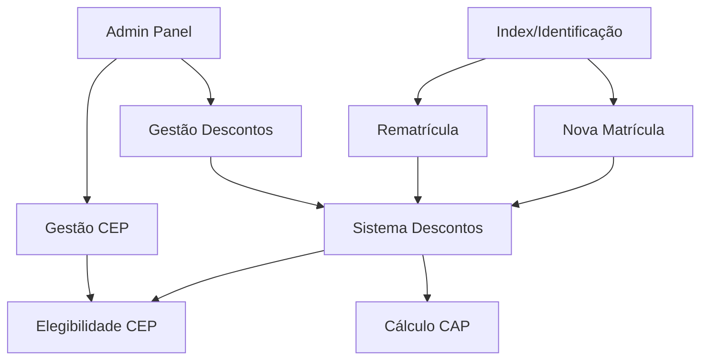

# Análise Arquitetural - Sistema de Matrículas e Descontos IESJE

## Visão Macro (Nível Executivo)

### Propósito do Sistema

O Sistema de Matrículas e Descontos do Instituto São João da Escócia (IESJE) é uma solução web completa para gerenciamento educacional que resolve três problemas de negócio críticos:

1. **Automatização do Processo de Matrícula**: Substitui processos manuais por um fluxo digital integrado
2. **Gestão Inteligente de Descontos**: Aplica regras de negócio complexas (até 60% de desconto cumulativo) com validação automática
3. **Trilhas de Aprovação Hierárquica**: Automatiza aprovações baseadas em níveis (≤20% automático, 21-50% coordenação, >50% direção)

### Módulos Centrais

O sistema é organizado em **quatro módulos funcionais principais**:

- **💰 Sistema de Descontos**: Motor central com 8 tipos de desconto (IIR, RES, PASS, PBS, COL, SAE, ABI, ABP, PAV) + descontos comerciais
- **📝 Fluxo de Matrícula**: Nova matrícula (6 etapas) e rematrícula (página única) com validação progressiva
- **🏫 Gestão Administrativa**: Painel com permissões granulares (super_admin, coordenador, operador)
- **📍 Elegibilidade por CEP**: Sistema automático que determina descontos aplicáveis baseado na localização

---

## Visão Intermediária (Nível Produto/Engenharia)

### Estrutura Geral e Camadas

O sistema segue uma **arquitetura feature-based** organizada hierarquicamente:

```
src/
├── features/                    # Módulos de negócio
│   ├── admin/                  # Sistema administrativo
│   ├── enrollment/             # Sistema de elegibilidade
│   ├── matricula-nova/         # Nova matrícula V2  
│   ├── matricula/              # Sistema de matrícula
│   └── rematricula/            # Rematrícula one-page
├── components/ui/              # Design system (shadcn/ui)
├── pages/                      # Rotas principais
├── lib/                        # Configurações globais
└── types/                      # Tipos compartilhados
```

### Stack Tecnológica Principal

- **Frontend**: React 18 + TypeScript + Vite (build tool otimizado)
- **Roteamento**: React Router DOM com rotas protegidas
- **Estado**: TanStack Query (servidor) + React Hook Form (formulários)
- **UI**: Tailwind CSS + shadcn/ui (sistema consistente baseado em Radix)
- **Backend**: Supabase (PostgreSQL + RLS + Auth + Edge Functions)
- **Validação**: Zod schemas com validação em tempo real

### Interação Entre Módulos



### Fluxo de Dados Básico

1. **Autenticação** → Supabase Auth + RLS (Row Level Security)
2. **Formulários** → React Hook Form + Zod → TanStack Query → Supabase
3. **Cache** → TanStack Query gerencia invalidação automática e sincronização
4. **Estado Global** → Distribuído via hooks customizados (não Redux/Zustand)

---

## Visão Técnica Detalhada (Nível Arquitetural)

### Hooks Customizados - Padrões e Organização

O sistema emprega **três categorias principais de hooks** com responsabilidades bem definidas:

#### 1. Hooks de Autenticação e Autorização
```typescript
// Exemplo: features/admin/hooks/useAdminAuth.ts
export const useAdminAuth = () => {
  return useQuery({
    queryKey: ['admin-session'],
    queryFn: async () => {
      // Verificação em duas etapas: Supabase Auth + admin_users
      const session = await supabase.auth.getSession()
      const adminUser = await checkAdminStatus(session.user.email)
      return { user: session.user, adminUser, role: adminUser.role }
    },
    staleTime: 5 * 60 * 1000, // Cache por 5 minutos
    retry: false // Sem retry para auth
  })
}
```

**Padrões identificados:**
- ✅ Separação clara entre autenticação (auth) e autorização (roles)
- ✅ Cache inteligente com `staleTime` apropriado para cada tipo
- ✅ Hooks especializados: `useAdminPermissions`, `useMatriculaAuth`
- ✅ Invalidação automática em login/logout

#### 2. Hooks de Dados/API
```typescript
// Exemplo: features/enrollment/hooks/useEligibleDiscounts.ts
export function useEligibleDiscounts(
  cep: string | undefined,
  allDiscounts: DatabaseDiscount[],
  trilhoType?: TrilhoType,
  options: EligibilityHookOptions = {}
): DiscountEligibilityResult {
  // Combina múltiplas fontes: CEP classification + regras hardcoded + banco
  const cepClassification = useCepClassification(cep)
  
  return useQuery({
    queryKey: ['discount-eligibility', cepClassification?.categoria, trilhoType],
    queryFn: async () => {
      const databaseRules = await fetchEligibilityRules()
      const analysis = analyzeDiscountEligibility(allDiscounts, cepClassification, databaseRules)
      return { eligibleDiscounts, ineligibleDiscounts, stats }
    },
    enabled: !!cep && allDiscounts.length > 0,
    staleTime: 2 * 60 * 1000, // Cache moderado para dados dinâmicos
  })
}
```

**Padrões identificados:**
- ✅ Composição de hooks: Um hook principal orquestra vários hooks menores
- ✅ Conditional fetching via `enabled`
- ✅ Fallback graceful: Se API falha, retorna todos descontos como elegíveis
- ✅ Memoização pesada para performance (useMemo em cálculos complexos)

#### 3. Hooks de Lógica de Negócio
```typescript
// Exemplo: features/matricula-nova/hooks/useEnrollmentForm.ts
export function useEnrollmentForm(): EnrollmentFormState & EnrollmentFormActions {
  const form = useForm<EnrollmentFormData>({
    resolver: zodResolver(enrollmentSchema),
    defaultValues,
    mode: 'onChange' // Validação em tempo real
  })
  
  // Cálculo reativo de pricing
  const pricing = useMemo(() => {
    if (!academicData?.seriesId || !series || !discounts) return null
    
    const selectedSeries = series.find(s => s.id === academicData.seriesId)
    const discountObjects = selectedDiscounts.map(/* mapeamento complexo */)
    
    return calculatePricing({
      baseValue: selectedSeries.value,
      discounts: discountObjects,
      trackId: academicData.trackId
    })
  }, [academicData, selectedDiscounts, discounts, series])
  
  return {
    form, currentStep, isSubmitting, pricing, approvalInfo,
    nextStep, prevStep, goToStep, submitForm, resetForm,
    canGoNext, canSubmit, /* ... */
  }
}
```

**Padrões identificados:**
- ✅ Hooks "orchestrator": Centralizam lógica complexa e retornam interface completa
- ✅ Memoização intensiva com dependências precisas
- ✅ Separação clara entre Estado (EnrollmentFormState) e Ações (EnrollmentFormActions)
- ✅ Encapsulamento: Lógica interna complexa, interface externa simples

### Integração com APIs e TanStack Query

#### Estrutura de Chamadas API

O sistema utiliza **Service Classes** para organizar chamadas API:

```typescript
// features/matricula-nova/services/api/enrollment.ts
export class EnrollmentApiService {
  // Métodos estáticos para todas as operações
  static async createEnrollment(formData: EnrollmentFormData): Promise<ApiResponse<DatabaseEnrollment>>
  static async listAdminEnrollments(params?: FilterParams): Promise<{ data: EnrollmentRecord[], count: number }>
  static async updateAdminEnrollment(id: string, patch: Partial<EnrollmentRecord>): Promise<EnrollmentRecord>
}
```

**Vantagens do padrão:**
- ✅ Operações relacionadas agrupadas logicamente
- ✅ Tipagem consistente com `ApiResponse<T>`
- ✅ Métodos estáticos evitam instanciação desnecessária
- ✅ Separação clara por funcionalidade (enrollment.ts, discounts.ts, etc.)

#### Query Keys e Cache Strategy

```typescript
// Padrão de Query Keys hierárquicas
const queryKeys = {
  // Genérico
  'admin-session': ['admin-session'],
  
  // Específico com parâmetros
  'discount-eligibility': ['discount-eligibility', cepCategory, trilhoType, discountIds],
  
  // Com relacionamentos
  'admin-enrollments': ['admin-enrollments', { page, filters, search }]
}
```

**Estratégias de Cache identificadas:**
- **Autenticação**: `staleTime: 5 min` (dados sensíveis, mas não mudam frequentemente)
- **Dados de configuração**: `staleTime: 10 min` (descontos, séries, trilhos)  
- **Elegibilidade**: `staleTime: 2 min` (dados derivados, podem mudar)
- **Listagens**: `staleTime: 30s` (dados que mudam constantemente)

#### Invalidação e Sincronização

```typescript
// Exemplo de mutations com invalidação inteligente
export const useCreateEnrollment = () => {
  const queryClient = useQueryClient()
  
  return useMutation({
    mutationFn: EnrollmentApiService.createEnrollment,
    onSuccess: (data) => {
      // Invalidação específica e eficiente
      queryClient.invalidateQueries({ queryKey: ['admin-enrollments'] })
      queryClient.invalidateQueries({ queryKey: ['recent-enrollments'] })
      
      // Inserção otimista no cache se possível
      queryClient.setQueryData(['enrollment', data.id], data)
    }
  })
}
```

#### Tratamento de Erro e Loading

**Padrões consistentes identificados:**
- ✅ **Fail-safe**: Sistema nunca quebra por falha de API (sempre tem fallback)
- ✅ **Loading states granulares**: Cada hook retorna `isLoading` específico
- ✅ **Error boundaries**: Componentes críticos envolvidos em ErrorBoundary
- ✅ **Retry strategy**: Configurado por tipo de operação (auth: 0, data: 3, mutations: 1)

### React Hook Form + Zod - Formulários e Validação

#### Estrutura de Schemas

O sistema possui **validação em duas camadas**:

```typescript
// 1. Schemas Zod para estrutura de dados
const studentSchema = z.object({
  name: z.string()
    .min(VALIDATION_RULES.MIN_NAME_LENGTH)
    .max(VALIDATION_RULES.MAX_NAME_LENGTH)
    .refine(isValidName, 'Nome deve conter apenas letras'),
  
  cpf: z.string()
    .regex(VALIDATION_RULES.CPF_REGEX)
    .refine(isValidCpf, 'CPF inválido'),
  
  birthDate: z.string()
    .refine(isValidDate, 'Data inválida')
    .refine(isValidAge, 'Idade deve estar entre 3 e 100 anos')
})

// 2. Validação de Steps para navegação
export function validateStep(stepNumber: number, formData: any): {
  isValid: boolean, errors: string[]
} {
  switch (stepNumber) {
    case 0: // Dados do aluno - validação mais permissiva para navegação
      if (formData.student?.cpf && !isValidCpf(formData.student.cpf)) {
        return { isValid: false, errors: ['CPF inválido'] }
      }
      return { isValid: true, errors: [] }
  }
}
```

**Estratégia dual identificada:**
- ✅ **Validação rigorosa** no schema Zod para submit final
- ✅ **Validação permissiva** para navegação entre steps
- ✅ **Validação customizada** com refine() para regras de negócio específicas

#### Integração com React Hook Form

```typescript
// Padrão Controller para campos complexos
<Controller
  name="student.cpf"
  control={form.control}
  render={({ field, fieldState }) => {
    const validation = field.value ? validators.cpf(field.value) : null
    
    return (
      <FormField error={fieldState.error?.message} required>
        <Input
          {...field}
          onChange={(e) => {
            const formatted = formatCPF(e.target.value) // Formatação automática
            field.onChange(formatted)
          }}
          placeholder="000.000.000-00"
        />
        <ValidationFeedback
          isValid={validation?.valid && !fieldState.error}
          isInvalid={!!fieldState.error}
          message={fieldState.error?.message || validation?.message}
        />
      </FormField>
    )
  }}
/>
```

**Padrões UX identificados:**
- ✅ **Formatação automática**: CPF, CEP, telefone formatados durante digitação
- ✅ **Validação em tempo real**: `mode: 'onChange'` com feedback imediato  
- ✅ **Feedback visual**: Ícones de validação + cores semânticas (verde/vermelho)
- ✅ **Acessibilidade**: `aria-invalid`, `role="alert"`, labels associadas

#### Resolvers e Integração

```typescript
const form = useForm<EnrollmentFormData>({
  resolver: zodResolver(enrollmentSchema), // Resolver automático
  defaultValues: getDefaultValues(), // Valores iniciais consistentes
  mode: 'onChange', // Validação reativa
  shouldFocusError: true, // UX: foco automático em erro
  shouldUseNativeValidation: false // Usar apenas validação customizada
})
```

### Estilização e UI - Tailwind + shadcn/ui

#### Padrões de Componentização

O sistema segue **duas camadas de componentes**:

```typescript
// 1. Componentes base (shadcn/ui) - src/components/ui/
export const Button = React.forwardRef<HTMLButtonElement, ButtonProps>(
  ({ className, variant, size, ...props }, ref) => {
    return (
      <button
        className={cn(buttonVariants({ variant, size, className }))}
        ref={ref}
        {...props}
      />
    )
  }
)

// 2. Componentes de domínio - src/features/*/components/ui/
export function FormField({ label, error, required, children, id }: FormFieldProps) {
  return (
    <div className="space-y-2">
      <label htmlFor={id} className="block text-sm font-medium text-gray-700">
        {label}
        {required && <span className="text-red-500 ml-1">*</span>}
      </label>
      {children}
      {error && (
        <p className="text-sm text-red-600 flex items-center" role="alert">
          <AlertCircle className="w-4 h-4 mr-1" />
          {error}
        </p>
      )}
    </div>
  )
}
```

#### Uso de tailwind-merge e cn()

```typescript
// Utilitário para merge inteligente de classes
import { clsx } from 'clsx'
import { twMerge } from 'tailwind-merge'

export function cn(...inputs: ClassValue[]) {
  return twMerge(clsx(inputs))
}

// Uso em componentes permite sobrescrita limpa
<Button className={cn("w-full", error && "border-red-500", className)} />
```

**Benefícios identificados:**
- ✅ **Consistência visual**: Design system unificado
- ✅ **Flexibilidade**: Componentes aceitam className para customização
- ✅ **Performance**: Tailwind CSS com purge automático via Vite
- ✅ **Manutenibilidade**: Mudanças globais propagadas automaticamente

#### Responsividade e Acessibilidade

```typescript
// Padrões de responsividade consistentes
<div className="grid gap-4 md:grid-cols-2 lg:grid-cols-3">
<Input className="w-full sm:w-auto" />
<Button size="sm" className="sm:size-default" />

// Acessibilidade incorporada
<ValidationFeedback
  isValid={isValid}
  isInvalid={!isValid}
  message={message}
  aria-live="polite" // Leitores de tela
  role="alert" // Quando há erro
/>
```

### Decisões de Design Arquiteturais Críticas

#### 1. Feature-Based vs Layer-Based Architecture

**Decisão**: Feature-based organization
**Rationale**: 
- ✅ Escalabilidade: Cada feature é independente
- ✅ Time ownership: Teams podem ser responsáveis por features específicas
- ✅ Menos conflitos: Mudanças isoladas por contexto de negócio

#### 2. TanStack Query vs. Redux/Zustand

**Decisão**: TanStack Query como estado principal
**Rationale**:
- ✅ Server state é 90% do estado da aplicação
- ✅ Cache automático elimina necessidade de gerenciamento manual
- ✅ Background updates e optimistic updates nativos
- ✅ Menos boilerplate comparado ao Redux

#### 3. Supabase RLS vs. Backend Custom

**Decisão**: Supabase com Row Level Security
**Rationale**:
- ✅ Segurança no nível do banco (não contornável)
- ✅ Real-time capabilities built-in
- ✅ Reduz complexidade de backend
- ✅ TypeScript auto-generation do schema

#### 4. Multi-step Form vs. Single Page

**Decisão**: Multi-step para nova matrícula, single-page para rematrícula
**Rationale**:
- ✅ Nova matrícula: Processo complexo, melhor UX dividido
- ✅ Rematrícula: Dados existentes, alterações menores
- ✅ Diferentes personas: Novos usuários vs. usuários existentes

---

## Conclusões e Recomendações

### Pontos Fortes da Arquitetura Atual

1. **Separação de Responsabilidades Excelente**
   - Features bem isoladas com interfaces claras
   - Hooks especializados por responsabilidade
   - Service classes para operações de API

2. **Performance Otimizada**
   - Cache inteligente com TanStack Query
   - Lazy loading de componentes pesados
   - Memoização agressiva em cálculos complexos

3. **Developer Experience Superior**
   - TypeScript end-to-end com tipos gerados automaticamente
   - Validação em tempo real com feedback visual
   - Hot reload otimizado via Vite

4. **Segurança Robusta**
   - Row Level Security no banco de dados
   - Permissões granulares por role
   - Validação dupla (client + server)

### Gargalos Técnicos e Riscos Identificados

#### 🔴 Riscos Críticos

1. **Acoplamento Excessivo em Hooks de Negócio**
   ```typescript
   // Problema: useEnrollmentForm faz muitas coisas
   const enrollment = useEnrollmentForm() // 400+ linhas
   // - Gerencia 6 steps
   // - Calcula pricing
   // - Valida formulários
   // - Integra com 5+ APIs
   ```
   **Impact**: Dificulta testes, reutilização e manutenção.

2. **Cache Mal Configurado em Cenários Edge**
   ```typescript
   // Problema: Invalidação muito genérica
   queryClient.invalidateQueries({ queryKey: ['admin-enrollments'] })
   // Invalidar TODAS as queries de admin é ineficiente
   ```
   **Impact**: Performance degradada com muitos usuários simultâneos.

3. **Duplicidade de Lógica de Elegibilidade**
   ```typescript
   // Problema: Regras de negócio em múltiplos locais
   // 1. Banco de dados (cep_desconto_elegibilidade)
   // 2. Código hardcoded (eligibilityRules.ts)
   // 3. Componentes (DiscountSelectionStep.tsx)
   ```
   **Impact**: Inconsistências e bugs quando regras mudam.

#### 🟡 Riscos Médios

4. **Estado de Formulário Distribuído**
   - Form state gerenciado em múltiplos lugares
   - Sincronização manual entre hooks
   - Dificuldade para debugging de estado

5. **Falta de Testes Automatizados**
   - Apenas testes unitários básicos encontrados
   - Nenhum teste de integração identificado
   - Lógica de negócio crítica sem cobertura

### Sugestões para Evolução Arquitetural

#### 1. Refatoração de Hooks Complexos

**Problema**: `useEnrollmentForm` é um "god hook" com muitas responsabilidades.

**Solução**: Decomposição em hooks menores e especializados.

```typescript
// ANTES: Um hook gigante
const enrollment = useEnrollmentForm() // 400 linhas

// DEPOIS: Composição de hooks especializados
const form = useEnrollmentFormState()
const navigation = useEnrollmentNavigation(form)
const pricing = useEnrollmentPricing(form.watch())
const validation = useEnrollmentValidation(form)
const submission = useEnrollmentSubmission(form, pricing)

const enrollment = {
  ...form,
  ...navigation, 
  ...pricing,
  ...validation,
  ...submission
}
```

**Benefícios**:
- ✅ Testabilidade: Cada hook pode ser testado isoladamente
- ✅ Reutilização: Hooks menores podem ser reutilizados em outros fluxos
- ✅ Manutenibilidade: Mudanças ficam localizadas

#### 2. Centralização de Camadas de API

**Problema**: Service classes espalhadas sem padronização.

**Solução**: API Client centralizado com interceptors.

```typescript
// src/lib/apiClient.ts
class ApiClient {
  constructor(private supabase: SupabaseClient) {}
  
  // Métodos padronizados para CRUD
  async findMany<T>(table: string, filters?: FilterOptions): Promise<T[]>
  async findById<T>(table: string, id: string): Promise<T | null>
  async create<T>(table: string, data: Partial<T>): Promise<T>
  async update<T>(table: string, id: string, data: Partial<T>): Promise<T>
  
  // Interceptors para logging, retry, etc.
  private withRetry<T>(operation: () => Promise<T>, retries: number = 3): Promise<T>
  private withLogging<T>(operation: () => Promise<T>): Promise<T>
}

// Uso nos services
export class EnrollmentApiService {
  private static client = new ApiClient(supabase)
  
  static async listEnrollments(filters?: EnrollmentFilters) {
    return this.client.findMany<EnrollmentRecord>('enrollments', filters)
  }
}
```

#### 3. Padronização de Query Keys

**Problema**: Query keys inconsistentes dificultam invalidação precisa.

**Solução**: Query key factory centralizada.

```typescript
// src/lib/queryKeys.ts
export const queryKeys = {
  // Factories por domínio
  admin: {
    all: ['admin'] as const,
    sessions: () => [...queryKeys.admin.all, 'sessions'] as const,
    users: () => [...queryKeys.admin.all, 'users'] as const,
    user: (id: string) => [...queryKeys.admin.users(), id] as const,
  },
  enrollments: {
    all: ['enrollments'] as const,
    lists: () => [...queryKeys.enrollments.all, 'lists'] as const,
    list: (filters: EnrollmentFilters) => [...queryKeys.enrollments.lists(), filters] as const,
    details: () => [...queryKeys.enrollments.all, 'details'] as const,
    detail: (id: string) => [...queryKeys.enrollments.details(), id] as const,
  }
}

// Uso: Invalidação precisa
queryClient.invalidateQueries({ 
  queryKey: queryKeys.enrollments.lists() // Só listas, não detalhes
})
```

#### 4. Organização de Query por Domínio

**Problema**: Queries espalhadas pelos hooks sem organização clara.

**Solução**: Query hooks organizados por domínio.

```typescript
// src/features/enrollments/queries/index.ts
export const enrollmentQueries = {
  // Query definitions
  all: () => ({ queryKey: queryKeys.enrollments.all }),
  
  list: (filters?: EnrollmentFilters) => ({
    queryKey: queryKeys.enrollments.list(filters || {}),
    queryFn: () => EnrollmentApiService.listEnrollments(filters),
    staleTime: 30 * 1000,
  }),
  
  detail: (id: string) => ({
    queryKey: queryKeys.enrollments.detail(id),
    queryFn: () => EnrollmentApiService.getById(id),
    staleTime: 5 * 60 * 1000,
  }),
}

// Uso nos hooks
export const useEnrollments = (filters?: EnrollmentFilters) => {
  return useQuery(enrollmentQueries.list(filters))
}
```

### Melhores Práticas Futuras

#### Para Escalabilidade

1. **Micro-frontends por Feature**
   - Considerar Module Federation para features grandes
   - Permite deploy independente de módulos
   - Reduz acoplamento entre teams

2. **Cache Strategy Mais Granular**
   ```typescript
   // Diferentes estratégias por tipo de dados
   const cacheStrategies = {
     reference: { staleTime: 30 * 60 * 1000 }, // 30 min (séries, descontos)
     userSettings: { staleTime: 10 * 60 * 1000 }, // 10 min
     realtime: { staleTime: 30 * 1000 }, // 30 sec (matrículas, aprovações)
     static: { staleTime: Infinity } // Dados que nunca mudam
   }
   ```

3. **Background Sync para Offline**
   - Service Workers para funcionalidade offline
   - Queue de operações para sincronizar quando online
   - Especialmente importante para áreas rurais

#### Para Legibilidade

1. **Documentação Arquitetural como Código**
   ```typescript
   // Documentar decisões no próprio código
   /**
    * @architectural-decision
    * Why: Hooks especializados em vez de um "god hook"
    * Trade-off: Mais arquivos vs. melhor testabilidade
    * Context: useEnrollmentForm estava com 400+ linhas
    */
   export const useEnrollmentFormState = () => { /* ... */ }
   ```

2. **Diagramas Auto-gerados**
   - Usar ferramentas como Madge para gerar dependency graphs
   - Diagramas de arquitetura atualizados automaticamente
   - Visualização de acoplamento entre módulos

#### Para Manutenibilidade

1. **Automated Testing Strategy**
   ```typescript
   // Testes por camada
   describe('Business Logic', () => {
     it('should calculate discount cap correctly')
     it('should validate CEP eligibility')
   })
   
   describe('Integration', () => {
     it('should sync form with API')
     it('should handle offline scenarios')
   })
   
   describe('E2E', () => {
     it('should complete enrollment flow')
   })
   ```

2. **Migration Strategy**
   - Implementar mudanças grandes de forma incremental
   - Feature flags para rollback seguro
   - Database migrations versionadas com rollback

### Roadmap Técnico Sugerido

#### Fase 1 (2-3 meses): Fundação
- [ ] Implementar Query Key Factory
- [ ] Refatorar hooks complexos (começar com useEnrollmentForm)
- [ ] Adicionar testes unitários para lógica de negócio crítica
- [ ] Padronizar tratamento de erro

#### Fase 2 (3-4 meses): Optimização  
- [ ] Implementar API Client centralizado
- [ ] Otimizar cache strategy (granular invalidation)
- [ ] Adicionar background sync básico
- [ ] Performance audit e optimizações

#### Fase 3 (4-6 meses): Escalabilidade
- [ ] Considerações para micro-frontends
- [ ] Implementar offline-first capabilities
- [ ] Advanced monitoring e observability
- [ ] Load testing e optimization

---

## Apêndices

### Métricas de Complexidade Atual

```
- Total de linhas de código: ~15,000 LoC
- Componentes React: ~80
- Hooks customizados: ~25
- Service classes: ~8
- Schemas Zod: ~15
- Query keys únicos: ~30+
- Páginas/rotas: ~20
```

### Dependencies Críticas

```json
{
  "@tanstack/react-query": "^4.x", // Estado do servidor
  "react-hook-form": "^7.x",       // Formulários
  "@hookform/resolvers": "^3.x",   // Integração Zod
  "zod": "^3.x",                   // Validação
  "@supabase/supabase-js": "^2.x", // Backend
  "tailwindcss": "^3.x",           // Styling
  "@radix-ui/*": "^1.x"            // Componentes base
}
```

### Glossário Técnico

- **CAP**: Limite máximo de desconto cumulativo
- **CEP Eligibility**: Sistema que determina descontos baseado no CEP
- **RLS**: Row Level Security (Supabase)
- **Trilho**: Categoria de desconto (especial, combinado, comercial)
- **Query Key**: Identificador único para cache no TanStack Query
- **Resolver**: Função que conecta Zod com React Hook Form

---

*Documento gerado através de análise arquitetural profunda do Sistema de Matrículas IESJE*
*Versão 1.0 - Janeiro 2025*