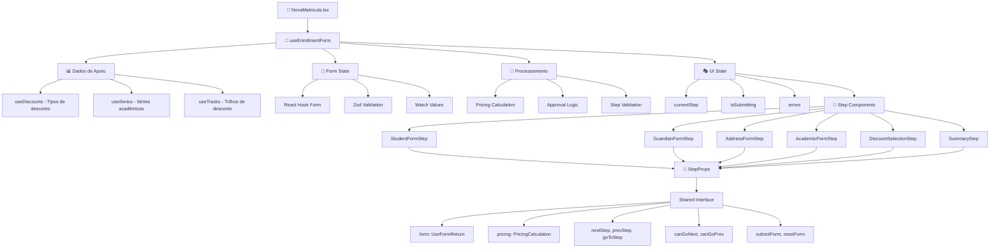
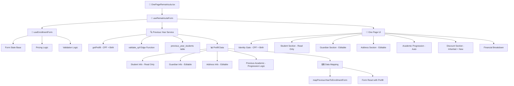

# useEnrollmentForm - Análise Detalhada e Interfaces de Fluxo

## Visão Geral Arquitetural

O `useEnrollmentForm` é o **"God Hook"** central do sistema que orquestra todo o fluxo de matrícula. Ele concentra 7 responsabilidades principais em um único hook de ~500 linhas:

1. **Estado do Formulário** (React Hook Form + Zod)
2. **Navegação entre Steps** (6 etapas com validação)
3. **Cálculos de Pricing** (descontos, CAP, aprovação)
4. **Integração com APIs** (dados de séries, trilhos, descontos)
5. **Validações Complexas** (campos obrigatórios + regras de negócio)
6. **Submissão Final** (persistência + error handling)
7. **Gerenciamento de Estado** (loading, errors, user session)

---

## Anatomia Detalhada do Hook

### 1. Configuração Base e Dependências

```typescript
export function useEnrollmentForm(): EnrollmentFormState & EnrollmentFormActions {
  // 🎯 Core: React Hook Form com validação Zod
  const form = useForm<EnrollmentFormData>({
    resolver: zodResolver(enrollmentSchema),
    defaultValues,
    mode: 'onChange' // Validação reativa
  })

  // 🏢 Context: Sessão de matrícula (operadores vs usuários comuns)
  const matriculaSession = useMatriculaAuth()
  
  // 📊 Data Loading: 4 fontes de dados principais
  const { data: discounts, isLoading: loadingDiscounts } = useDiscounts()
  const { data: series, isLoading: loadingSeries } = useSeries()
  const { data: tracks, isLoading: loadingTracks } = useTracks()
  
  // 🎭 Local State: Estados específicos do fluxo
  const [currentStep, setCurrentStep] = useState(FIRST_STEP)
  const [isSubmitting, setIsSubmitting] = useState(false)
  const [errors, setErrors] = useState<Record<string, string>>({})
```

**Problemas identificados:**
- ❌ Hook importa 4+ hooks de dados simultaneamente 
- ❌ Estado local duplicado (currentStep no hook + no form)
- ❌ Acoplamento alto com múltiplas fontes de dados

### 2. Sistema de Cálculos Reativos

```typescript
// 💰 PRICING CALCULATION - Reativo baseado em form.watch()
const pricing = useMemo((): PricingCalculation | null => {
  // Coleta dados do formulário
  const academicData = watchedValues.academic
  const selectedDiscounts = watchedValues.selectedDiscounts || []
  
  if (!academicData?.seriesId || !series || !discounts) return null
  
  // Busca série selecionada
  const selectedSeries = series.find(s => s.id === academicData.seriesId)
  if (!selectedSeries) return null
  
  // Mapeia descontos selecionados
  const discountObjects = selectedDiscounts.map(sd => {
    const discount = discounts.find(d => d.id === sd.id)
    return {
      id: sd.id,
      code: discount?.codigo || '',
      name: discount?.nome || '',
      category: discount?.categoria || 'regular',
      percentage: sd.percentual,
      value: (selectedSeries.valor_mensal_sem_material * sd.percentual) / 100
    }
  })
  
  // 🧮 Cálculo central
  return calculatePricing({
    baseValue: selectedSeries.valor_mensal_sem_material,
    materialCost: selectedSeries.valor_material || 0,
    discounts: discountObjects,
    trackId: academicData.trackId,
    tracks
  })
}, [watchedValues, series, discounts, tracks])
```

**Complexidade do Cálculo:**
- ✅ Reativo via `useMemo` com dependências precisas
- ⚠️ Lógica de negócio complexa misturada com apresentação
- ❌ Dificulta testing isolado dos cálculos

### 3. Sistema de Navegação e Validação

```typescript
// 🧭 NAVEGAÇÃO - Validação progressiva com regras especiais
const nextStep = useCallback(() => {
  const currentFormData = form.getValues()
  
  // Validação do step atual
  const stepValidation = validateStep(currentStep, currentFormData)
  if (!stepValidation.isValid) {
    setErrors(prev => ({ ...prev, [currentStep]: stepValidation.errors.join(', ') }))
    toast.error('Por favor, corrija os erros antes de continuar')
    return
  }
  
  // Validação de campos obrigatórios
  const requiredValidation = validateRequiredFields(currentStep, currentFormData)
  if (!requiredValidation.hasRequiredFields) {
    setErrors(prev => ({
      ...prev,
      [currentStep]: `Campos obrigatórios: ${requiredValidation.missingFields.join(', ')}`
    }))
    return
  }
  
  // 🚨 REGRA ESPECIAL: Step 0 - não avança com CPF duplicado
  if (currentStep === FIRST_STEP) {
    const cpfError = form.getFieldState('student.cpf').error
    if (cpfError) {
      toast.error('CPF inválido ou já cadastrado. Corrija antes de continuar.')
      return
    }
  }
  
  // Avanço seguro
  if (currentStep < LAST_STEP) {
    setCurrentStep(prev => prev + 1)
    toast.success('Progresso salvo!')
  }
}, [currentStep, form])
```

**Características do Sistema de Navegação:**
- ✅ Validação híbrida (permissiva para navegação, rigorosa para submit)
- ✅ Regras especiais por step (CPF, CAP limits, etc.)
- ❌ Lógica de validação espalhada em múltiplas funções

### 4. Integração com Escola (Operadores)

```typescript
// 🏢 ESCOLA ENFORCEMENT - Para operadores de matrícula
useEffect(() => {
  if (matriculaSession.data?.matriculaUser?.escola) {
    const lockedEscola = mapMatriculaUserEscolaToFormValue(
      matriculaSession.data.matriculaUser.escola
    )
    
    // Force escola baseada no usuário logado
    const currentEscola = form.getValues('student.escola')
    if (currentEscola !== lockedEscola) {
      form.setValue('student.escola', lockedEscola, { 
        shouldDirty: true, 
        shouldValidate: true 
      })
    }
  }
}, [matriculaSession.data, form])
```

**Impacto na UX:**
- ✅ Campo escola automaticamente preenchido para operadores
- ✅ Previne erros de seleção incorreta de escola
- ⚠️ Lógica específica de role misturada com lógica de form

---

## Interface com Fluxo de Aluno Novo

### Estrutura da Página NovaMatricula.tsx

```typescript
export default function NovaMatricula() {
  // 🎯 ÚNICA dependência: o hook centralizado
  const enrollment = useEnrollmentForm()

  // 🎭 Renderização condicional baseada no step atual
  const renderCurrentStep = () => {
    const stepProps = { ...enrollment } // Spread completo das props
    
    switch (enrollment.currentStep) {
      case 0: return <StudentFormStep {...stepProps} />      // Dados do Aluno
      case 1: return <GuardianFormStep {...stepProps} />     // Responsáveis  
      case 2: return <AddressFormStep {...stepProps} />      // Endereço
      case 3: return <AcademicFormStep {...stepProps} />     // Série + Turno
      case 4: return <DiscountSelectionStep {...stepProps} />// Descontos + CAP
      case 5: return <SummaryStep {...stepProps} />          // Revisão + Submit
      default: return <StudentFormStep {...stepProps} />
    }
  }

  return (
    <ErrorBoundary>
      <div className="min-h-screen bg-gray-50">
        <StepIndicator 
          currentStep={enrollment.currentStep}
          totalSteps={TOTAL_STEPS}
          completedSteps={getCompletedSteps(enrollment)}
        />
        
        <main className="container mx-auto py-8">
          <Suspense fallback={<LoadingSpinner />}>
            {renderCurrentStep()}
          </Suspense>
        </main>
      </div>
    </ErrorBoundary>
  )
}
```

### Fluxo de Dados - Aluno Novo



### Interface StepProps - Contrato Compartilhado

```typescript
// 🤝 CONTRATO: Cada step recebe esta interface completa
export interface StepProps extends EnrollmentFormState, EnrollmentFormActions {
  // Estado do formulário
  form: UseFormReturn<EnrollmentFormData>
  currentStep: number
  isSubmitting: boolean
  errors: Record<string, string>
  pricing: PricingCalculation | null
  isLoadingData: boolean
  
  // Dados de apoio (carregados no hook)
  discounts?: DatabaseDiscount[]
  series?: Series[]
  tracks?: Track[]
  
  // Ações de navegação
  nextStep: () => void
  prevStep: () => void
  goToStep: (step: number) => void
  
  // Ações de controle
  submitForm: () => Promise<void>
  resetForm: () => void
  
  // Estados de controle
  canGoNext: boolean
  canGoPrev: boolean
  isFirstStep: boolean
  isLastStep: boolean
}
```

**Vantagens da Interface:**
- ✅ **Consistency**: Todos os steps têm acesso aos mesmos dados
- ✅ **Flexibility**: Steps podem escolher o que usar
- ✅ **Maintainability**: Mudanças no hook se propagam automaticamente

**Desvantagens:**
- ❌ **Over-props**: Steps recebem dados que não precisam
- ❌ **Tight coupling**: Mudança no hook afeta todos os steps
- ❌ **Testing complexity**: Difícil mockar interface completa

---

## Interface com Fluxo de Rematrícula

### Hook Wrapper - useRematriculaForm

```typescript
export function useRematriculaForm(cpf: string, birthDateHint: string) {
  // 🔄 REUSO: Aproveita useEnrollmentForm base
  const enrollment = useEnrollmentForm()
  
  // 📊 Estados específicos da rematrícula
  const [loading, setLoading] = useState(false)
  const [error, setError] = useState<string | null>(null)  
  const [prefill, setPrefill] = useState<PreviousYearPrefill | null>(null)
  
  // 🔍 Busca dados do ano anterior
  const load = useCallback(async () => {
    if (!cpf || !birthDateHint) return
    
    setLoading(true)
    try {
      const data = await PreviousYearService.getPrefill(cpf, birthDateHint)
      setPrefill(data)
      
      // 🎯 CORE INNOVATION: Mapeia dados antigos para formato novo
      const mapped = mapPreviousYearToEnrollmentForm(data)
      
      // Reset form apenas se houver mudança (evita loops)
      const currentCpf = enrollment.form.getValues('student.cpf')
      if ((currentCpf || '').replace(/\D/g, '') !== (mapped.student.cpf || '').replace(/\D/g, '')) {
        enrollment.form.reset(mapped, { 
          keepDefaultValues: false, 
          keepDirty: false, 
          keepTouched: false 
        })
      }
    } catch (e) {
      setError(e?.message || 'Falha ao carregar dados para rematrícula')
    } finally {
      setLoading(false)
    }
  }, [cpf, birthDateHint, enrollment.form])

  return {
    enrollment,    // 🎯 Hook base exposto
    prefill,      // Dados carregados do ano anterior
    loading,      // Estado de carregamento
    error,        // Erros específicos da rematrícula
    ready: !!prefill && !loading && !error,
    reload: load,
  }
}
```

### Fluxo de Dados - Rematrícula



### Página OnePageRematricula.tsx - Arquitetura

```typescript
export default function OnePageRematricula() {
  // 📍 Estado de entrada
  const [cpf, setCpf] = useState(initialCpf)
  const [birthHint, setBirthHint] = useState('')
  
  // 🎯 Hook principal
  const { enrollment, prefill, loading, error, ready, reload } = useRematriculaForm(cpf, birthHint)
  
  // 📚 Hooks especializados
  const progression = useAcademicProgression(enrollment.form, previousAcademic, escola)
  const discounts = useRematriculaDiscounts(enrollment.form, prefill)

  return (
    <main className="container py-8 space-y-8">
      {/* 🚪 Portão de Identificação */}
      <IdentityGate 
        cpf={cpf} 
        birthHint={birthHint}
        onCpfChange={setCpf}
        onBirthChange={setBirthHint}
        onLoad={reload}
        loading={loading}
        error={error}
      />
      
      {ready && (
        <>
          {/* 👤 Dados do Aluno - READ ONLY */}
          <StudentSection 
            student={prefill.student}
            readOnly={true}
          />
          
          {/* 👨‍👩‍👧‍👦 Responsáveis - EDITABLE */}
          <GuardianSection 
            form={enrollment.form}
            prefill={prefill.guardians}
          />
          
          {/* 📍 Endereço - EDITABLE */}
          <AddressSection
            form={enrollment.form}
            prefill={prefill.address}
          />
          
          {/* 📚 Progressão Acadêmica - AUTO */}
          <AcademicProgressionSection
            progression={progression}
            onProgressionChange={handleProgressionChange}
          />
          
          {/* 💰 Descontos - INHERITED + NEW */}
          <DiscountSection
            form={enrollment.form}
            discounts={discounts}
            pricing={enrollment.pricing}
          />
          
          {/* 💰 Resumo Financeiro */}
          <FinancialBreakdownCard 
            pricing={enrollment.pricing}
            showActions={true}
            onSubmit={() => enrollment.submitForm()}
          />
        </>
      )}
    </main>
  )
}
```

---

## Comparação: Nova Matrícula vs Rematrícula

| Aspecto | Nova Matrícula | Rematrícula |
|---------|----------------|-------------|
| **UI Pattern** | Multi-step wizard (6 steps) | Single-page form |
| **Data Source** | User input from scratch | Previous year + updates |
| **Navigation** | Step-by-step validation | Section-based editing |
| **Validation** | Progressive (step-by-step) | Real-time (all sections) |
| **User Journey** | Discovery & Learning | Quick Updates |
| **Complexity** | High (new users need guidance) | Medium (familiar users) |
| **Hook Usage** | Direct `useEnrollmentForm` | Wrapped `useRematriculaForm` |
| **State Management** | Step-based state machine | Form-based with prefill |
| **Error Handling** | Step-specific errors | Section-specific errors |

### Pontos de Convergência

Ambos os fluxos **convergem** no `useEnrollmentForm` para:

1. **Cálculos de Pricing** - Mesma lógica para ambos
2. **Validação Final** - Schema Zod compartilhado  
3. **Submissão** - Mesmo `EnrollmentApiService.createEnrollment()`
4. **Estados de Loading/Error** - Padrões consistentes

### Pontos de Divergência

**Nova Matrícula:**
- Estado controlado por `currentStep`
- Validação progressive step-by-step
- UX educativa (tooltips, explicações)
- Zero knowledge assumido

**Rematrícula:**
- Estado controlado por seções editáveis
- Validação simultânea de todas seções
- UX eficiente (campos pré-preenchidos)
- Knowledge assumido do processo anterior

---

## Problemas Arquiteturais Identificados

### 1. God Hook Anti-Pattern

```typescript
// ❌ PROBLEMA: useEnrollmentForm faz TUDO
const enrollment = useEnrollmentForm()
// - Form state (React Hook Form)
// - Step navigation (6 steps)
// - Data fetching (4+ APIs) 
// - Pricing calculation (complex business logic)
// - Validation (multiple layers)
// - Submission (API integration)
// - Error handling (global + local)
// - User session (role-based logic)
```

**Impactos:**
- 🔴 **Testing**: Impossível testar lógica isoladamente
- 🔴 **Maintainability**: Mudanças afetam múltiplas funcionalidades
- 🔴 **Reusability**: Hook muito específico, difícil reutilizar
- 🔴 **Performance**: Re-renders desnecessários em todas as dependências

### 2. Prop Drilling Excessivo

```typescript
// ❌ PROBLEMA: StepProps interface muito pesada
interface StepProps extends EnrollmentFormState, EnrollmentFormActions {
  form, currentStep, isSubmitting, errors, pricing, isLoadingData,
  discounts, series, tracks, nextStep, prevStep, goToStep,
  submitForm, resetForm, canGoNext, canGoPrev, isFirstStep, isLastStep
}

// Cada step recebe 15+ props, mas usa apenas 3-4
<StudentFormStep {...enrollment} />  // recebe tudo, usa form + nextStep
<AddressFormStep {...enrollment} />  // recebe tudo, usa form + pricing
```

**Impactos:**
- 🟡 **Over-coupling**: Components dependem de mais do que precisam
- 🟡 **Mocking complexity**: Testes precisam mockar props não utilizadas
- 🟡 **Bundle size**: Props desnecessárias podem afetar tree-shaking

### 3. Estado Duplicado e Dessincronia

```typescript
// ❌ PROBLEMA: currentStep existe em dois locais
const [currentStep, setCurrentStep] = useState(FIRST_STEP)  // Hook local
// E também em:
defaultValues: { currentStep: FIRST_STEP }  // Form schema
```

**Impactos:**
- 🔴 **Inconsistency**: Pode haver dessincronia entre estados
- 🟡 **Debugging**: Dificulta rastreamento de bugs de navegação

### 4. Validação Fragmentada

```typescript
// ❌ PROBLEMA: Lógica de validação espalhada
validateStep(currentStep, formData)           // Em validations.ts
validateRequiredFields(currentStep, formData) // Em validations.ts  
form.getFieldState('student.cpf').error      // No hook
pricing && !pricing.isValid                  // No hook
```

**Impactos:**
- 🔴 **Business logic leakage**: Regras de negócio em múltiplos locais
- 🟡 **Maintainability**: Mudança de regra requer updates em vários arquivos

---

## Proposta de Refatoração

### Fase 1: Decomposição do God Hook

**Objetivo**: Quebrar `useEnrollmentForm` em hooks especializados e composáveis.

#### 1.1. useEnrollmentFormState - Estado Base

```typescript
export function useEnrollmentFormState(initialValues?: Partial<EnrollmentFormData>) {
  const form = useForm<EnrollmentFormData>({
    resolver: zodResolver(enrollmentSchema),
    defaultValues: { ...defaultValues, ...initialValues },
    mode: 'onChange'
  })
  
  // Apenas estado do formulário, sem lógica de negócio
  return {
    form,
    values: form.watch(),
    isValid: form.formState.isValid,
    isDirty: form.formState.isDirty,
    errors: form.formState.errors
  }
}
```

#### 1.2. useEnrollmentNavigation - Navegação entre Steps

```typescript
export function useEnrollmentNavigation(form: UseFormReturn<EnrollmentFormData>) {
  const [currentStep, setCurrentStep] = useState(0)
  
  const canGoNext = useMemo(() => {
    const validation = validateStep(currentStep, form.getValues())
    return validation.isValid && !validation.hasBlockingErrors
  }, [currentStep, form.watch()])
  
  const nextStep = useCallback(() => {
    if (canGoNext && currentStep < LAST_STEP) {
      setCurrentStep(prev => prev + 1)
    }
  }, [canGoNext, currentStep])
  
  return {
    currentStep,
    nextStep,
    prevStep: () => setCurrentStep(prev => Math.max(0, prev - 1)),
    goToStep: (step: number) => setCurrentStep(step),
    canGoNext,
    canGoPrev: currentStep > 0,
    isFirstStep: currentStep === 0,
    isLastStep: currentStep === LAST_STEP
  }
}
```

#### 1.3. useEnrollmentPricing - Cálculos Financeiros

```typescript
export function useEnrollmentPricing(
  values: EnrollmentFormData,
  series: Series[],
  discounts: Discount[],
  tracks: Track[]
) {
  const pricing = useMemo(() => {
    if (!values.academic?.seriesId || !series.length) return null
    
    return calculatePricing({
      baseValue: series.find(s => s.id === values.academic.seriesId)?.value || 0,
      discounts: values.selectedDiscounts.map(sd => 
        discounts.find(d => d.id === sd.id)
      ).filter(Boolean),
      trackId: values.academic.trackId,
      tracks
    })
  }, [values, series, discounts, tracks])
  
  const approvalInfo = useMemo(() => {
    if (!pricing) return null
    return determineApprovalLevel(pricing.totalDiscountPercentage)
  }, [pricing])
  
  return {
    pricing,
    approvalInfo,
    isValid: pricing?.isValid ?? false,
    needsApproval: approvalInfo?.level !== 'automatic'
  }
}
```

#### 1.4. useEnrollmentSubmission - Persistência

```typescript
export function useEnrollmentSubmission(
  form: UseFormReturn<EnrollmentFormData>,
  pricing: PricingCalculation | null
) {
  const [isSubmitting, setIsSubmitting] = useState(false)
  const [submitError, setSubmitError] = useState<string | null>(null)
  
  const submitForm = useCallback(async () => {
    if (!pricing?.isValid) {
      throw new Error('Configuração de descontos inválida')
    }
    
    try {
      setIsSubmitting(true)
      setSubmitError(null)
      
      const formData = form.getValues()
      const result = await EnrollmentApiService.createEnrollment(formData)
      
      if (result.error) throw new Error(result.error)
      
      toast.success('Matrícula criada com sucesso!')
      form.reset()
      
    } catch (error) {
      const message = error instanceof Error ? error.message : 'Erro desconhecido'
      setSubmitError(message)
      toast.error('Erro ao criar matrícula: ' + message)
    } finally {
      setIsSubmitting(false)
    }
  }, [form, pricing])
  
  return {
    submitForm,
    isSubmitting,
    submitError,
    canSubmit: pricing?.isValid && form.formState.isValid
  }
}
```

### Fase 2: Composição dos Hooks

```typescript
// 🎯 NOVO: useEnrollmentForm como compositor
export function useEnrollmentForm(initialValues?: Partial<EnrollmentFormData>) {
  // 1. Estado base do formulário
  const formState = useEnrollmentFormState(initialValues)
  
  // 2. Navegação entre steps
  const navigation = useEnrollmentNavigation(formState.form)
  
  // 3. Dados de apoio (manter carregamento, mas organizados)
  const { data: discounts } = useDiscounts()
  const { data: series } = useSeries()
  const { data: tracks } = useTracks()
  
  // 4. Cálculos de pricing
  const pricingState = useEnrollmentPricing(formState.values, series || [], discounts || [], tracks || [])
  
  // 5. Submissão
  const submission = useEnrollmentSubmission(formState.form, pricingState.pricing)
  
  // Interface limpa e composável
  return {
    // Form state
    form: formState.form,
    values: formState.values,
    isValid: formState.isValid,
    
    // Navigation
    ...navigation,
    
    // Pricing
    pricing: pricingState.pricing,
    approvalInfo: pricingState.approvalInfo,
    
    // Submission
    ...submission,
    
    // Data loading states
    isLoadingData: !discounts || !series || !tracks
  }
}
```

### Fase 3: Interface Props Especializada

```typescript
// 🎯 NOVO: Props específicas por step em vez de interface gigante
interface BaseStepProps {
  form: UseFormReturn<EnrollmentFormData>
  onNext: () => void
  onPrev: () => void
  canGoNext: boolean
  canGoPrev: boolean
}

interface StudentStepProps extends BaseStepProps {
  // Sem props extras - apenas form state
}

interface DiscountStepProps extends BaseStepProps {
  pricing: PricingCalculation | null
  availableDiscounts: Discount[]
  tracks: Track[]
}

interface SummaryStepProps extends BaseStepProps {
  pricing: PricingCalculation | null
  approvalInfo: ApprovalInfo | null
  onSubmit: () => Promise<void>
  isSubmitting: boolean
}
```

### Fase 4: Hooks Especializados para Rematrícula

```typescript
// 🎯 MELHORADO: useRematriculaForm mais limpo
export function useRematriculaForm(cpf: string, birthDateHint: string) {
  // 1. Carregar dados do ano anterior
  const prefillData = usePreviousYearData(cpf, birthDateHint)
  
  // 2. Inicializar form com dados pré-preenchidos
  const enrollment = useEnrollmentForm(prefillData.mappedData)
  
  // 3. Hooks específicos da rematrícula
  const progression = useAcademicProgression(enrollment.form, prefillData.previousAcademic)
  const inheritedDiscounts = useInheritedDiscounts(prefillData.discounts)
  
  return {
    enrollment,
    prefillData,
    progression,
    inheritedDiscounts,
    ready: prefillData.ready
  }
}
```

---

## Benefícios da Refatoração

### 1. Testabilidade Melhorada

```typescript
// ✅ DEPOIS: Cada hook pode ser testado isoladamente
describe('useEnrollmentPricing', () => {
  it('should calculate pricing correctly', () => {
    const { result } = renderHook(() => 
      useEnrollmentPricing(mockFormData, mockSeries, mockDiscounts, mockTracks)
    )
    
    expect(result.current.pricing.finalValue).toBe(650.00)
    expect(result.current.approvalInfo.level).toBe('coordinator')
  })
})

describe('useEnrollmentNavigation', () => {
  it('should not allow next step with invalid data', () => {
    const { result } = renderHook(() => useEnrollmentNavigation(mockForm))
    
    expect(result.current.canGoNext).toBe(false)
  })
})
```

### 2. Reutilização Aumentada

```typescript
// ✅ DEPOIS: Hooks menores podem ser reutilizados
export function QuickPricingCalculator() {
  const pricing = useEnrollmentPricing(previewData, series, discounts, tracks)
  
  return <PricingPreview pricing={pricing.pricing} />
}

export function StandaloneDiscountSelector() {
  const pricing = useEnrollmentPricing(formData, series, discounts, tracks)
  
  return <DiscountUI pricing={pricing} />
}
```

### 3. Performance Otimizada

```typescript
// ✅ DEPOIS: Re-renders mais granulares
function StudentStep() {
  const formState = useEnrollmentFormState()  // Só re-render se form mudar
  const navigation = useEnrollmentNavigation()  // Só re-render se step mudar
  // Não precisa recalcular pricing se só o nome do aluno mudou
}

function DiscountStep() { 
  const formState = useEnrollmentFormState()
  const pricing = useEnrollmentPricing()  // Só recalcula se discounts mudarem
  // Otimização natural via dependências precisas
}
```

### 4. Manutenibilidade Aprimorada

```typescript
// ✅ DEPOIS: Mudanças localizadas
// Para alterar lógica de pricing: apenas useEnrollmentPricing
// Para alterar navegação: apenas useEnrollmentNavigation  
// Para alterar validação: apenas useEnrollmentValidation
```

---

## Roadmap de Implementação

### Sprint 1 (1-2 semanas): Fundação
- [ ] Criar `useEnrollmentFormState` 
- [ ] Criar `useEnrollmentNavigation`
- [ ] Testes unitários para hooks base
- [ ] Refatorar 1-2 steps para usar nova interface

### Sprint 2 (1-2 semanas): Lógica de Negócio  
- [ ] Criar `useEnrollmentPricing`
- [ ] Criar `useEnrollmentSubmission`
- [ ] Migrar cálculos complexos
- [ ] Testes de integração entre hooks

### Sprint 3 (1-2 semanas): Integração
- [ ] Refatorar `useEnrollmentForm` como compositor
- [ ] Migrar todos os steps para nova interface
- [ ] Atualizar `NovaMatricula.tsx`
- [ ] Testes end-to-end do fluxo

### Sprint 4 (1 semana): Rematrícula
- [ ] Refatorar `useRematriculaForm`
- [ ] Criar hooks especializados para rematrícula
- [ ] Atualizar `OnePageRematricula.tsx`
- [ ] Validação final e cleanup

### Sprint 5 (1 semana): Polish & Docs
- [ ] Remover código legado
- [ ] Documentar novos hooks
- [ ] Performance audit
- [ ] Training da equipe

---

## Métricas de Sucesso

### Antes da Refatoração
```
- useEnrollmentForm: 500+ linhas
- Complexidade ciclomática: >15
- Dependências: 8+ hooks externos
- Test coverage: <30%
- Props por step: 15+ props
```

### Após a Refatoração (Meta)
```
- Hooks individuais: <100 linhas cada
- Complexidade ciclomática: <5 por hook
- Dependências: 1-3 hooks por contexto
- Test coverage: >80%
- Props por step: 3-5 props específicas
```

### ROI Esperado

**Desenvolvimento**:
- ⏱️ 40% menos tempo para adicionar novos steps
- 🐛 60% menos bugs relacionados a estado
- 🧪 5x mais facilidade para escrever testes

**Manutenção**:
- 📝 Mudanças de regras de negócio isoladas
- 🔄 Reutilização de hooks em outros fluxos
- 👥 Onboarding mais rápido de novos desenvolvedores

---

*Esta análise fornece o roadmap completo para evoluir a arquitetura de `useEnrollmentForm` de um "God Hook" para uma arquitetura composável e maintível.*

<function_calls>
<invoke name="TodoWrite">
<parameter name="todos">[{"content": "Analisar detalhadamente o useEnrollmentForm", "status": "completed", "activeForm": "Analisando detalhadamente o useEnrollmentForm"}, {"content": "Mapear interface com fluxo de aluno novo", "status": "completed", "activeForm": "Mapeando interface com fluxo de aluno novo"}, {"content": "Mapear interface com fluxo de rematr\u00edcula", "status": "completed", "activeForm": "Mapeando interface com fluxo de rematr\u00edcula"}, {"content": "Criar diagrama de fluxo e intera\u00e7\u00f5es", "status": "completed", "activeForm": "Criando diagrama de fluxo e intera\u00e7\u00f5es"}, {"content": "Documentar proposta de refatora\u00e7\u00e3o", "status": "completed", "activeForm": "Documentando proposta de refatora\u00e7\u00e3o"}]